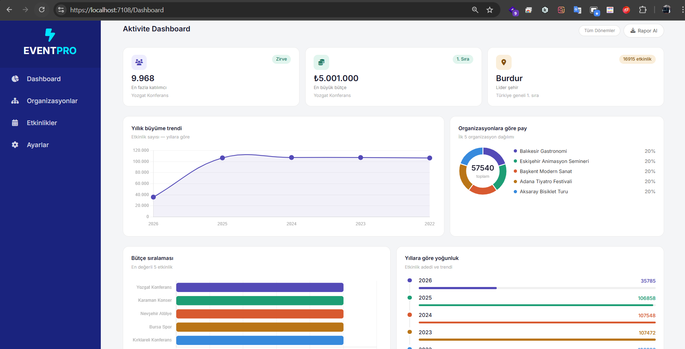
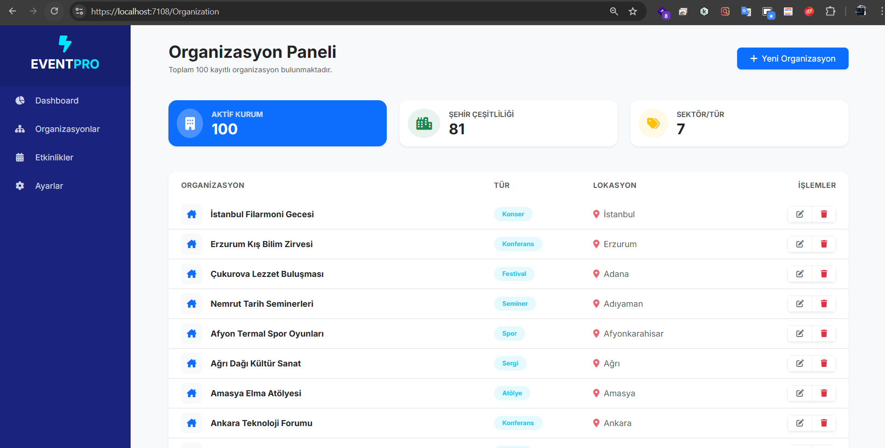
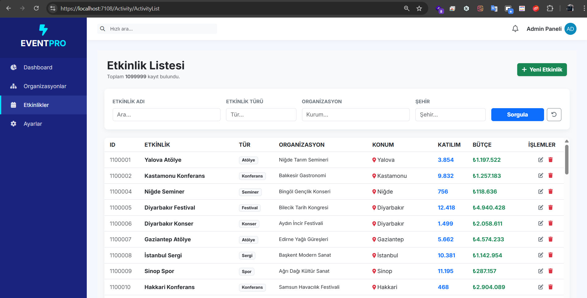
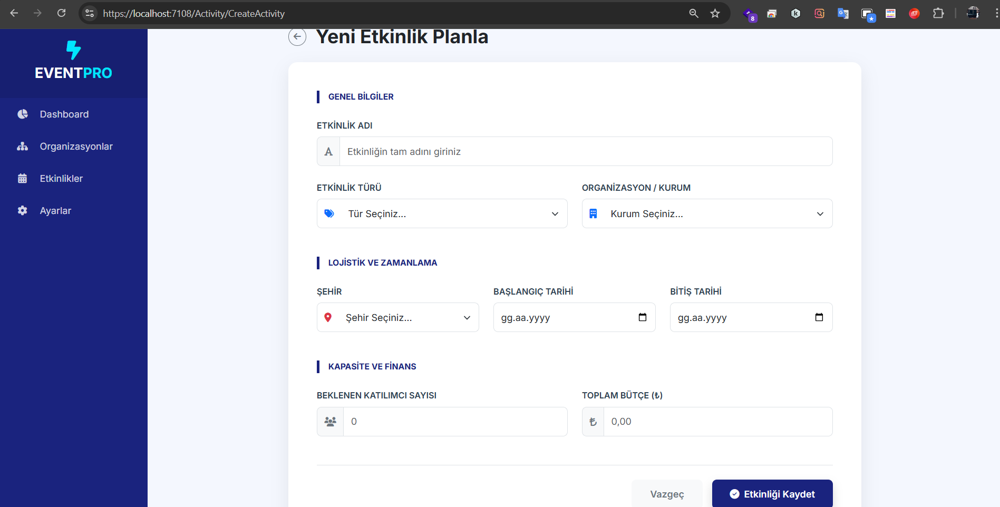

# 🎯 EventPro — Etkinlik Yönetim ve Analiz Platformu


> Gerçek zamanlı analiz paneliyle tam kapsamlı bir etkinlik yönetim sistemi. Etkinlikler, organizasyonlar, şehirler, bütçeler ve katılımcı verilerini tek bir platformda takip edin.

---

## ✨ Özellikler

- 📊 **Analiz Paneli** — En iyi şehirler, organizasyonlar, yıllık trendler, bütçe sıralamaları
- 🏙️ **Şehir Bazlı Analiz** — Etkinlik sayısı ve katılımcı yoğunluğunu gösteren balon grafiği
- 💰 **Bütçe Takibi** — En yüksek bütçeli 5 etkinlik için yatay bar grafiği
- 📅 **Zaman Çizelgesi** — İlerleme çubukları ile yıllara göre etkinlik yoğunluğu
- 🍩 **Organizasyon Payı** — Organizasyon dağılımını gösteren halka grafiği
- 🔍 **Etkinlik Filtreleme** — Şehir, tür, organizasyon ve tarih aralığına göre filtreleme

---

## 🛠️ Teknoloji Yığını

| Katman | Teknoloji |
|--------|-----------|
| Backend | ASP.NET Core MVC (.NET 8) |
| ORM | Dapper |
| Veritabanı | Microsoft SQL Server |
| Frontend | Razor Views, Chart.js, Font Awesome |
| Stil | Özel CSS (Inter font) |

---

## 🚀 Kurulum

### Gereksinimler

- [.NET 8 SDK](https://dotnet.microsoft.com/download)
- [SQL Server](https://www.microsoft.com/en-us/sql-server/sql-server-downloads) veya SQL Server Express
- [Visual Studio 2022](https://visualstudio.microsoft.com/) ya da VS Code

### Adımlar

**1. Depoyu klonlayın**
```bash
git clone https://github.com/kullaniciadi/EventPro.git
cd EventPro
```

**2. Veritabanı bağlantısını yapılandırın**

`appsettings.json` dosyasını açıp bağlantı dizesini güncelleyin:
```json
{
  "ConnectionStrings": {
    "DefaultConnection": "Server=SUNUCU_ADI;Database=EtkinlikDb;Trusted_Connection=True;"
  }
}
```
## 📸 Ekran Görüntüleri

### 🖥️ Ana Dashboard


### 🍩 Organizasyon Dağılımı


#### 🗓️ Etkinlik Listesi


### ➕ Yeni Etkinlik Ekleme

